# Project Title - Flutter Multi-Screen App

A Flutter multi-screen demo application built for classroom-style learning and practice. It demonstrates a simple registration and login flow, an authenticated dashboard, and a detail screen for course/subject information. The project is intentionally lightweight and uses in-memory auth state, which makes it easy to understand and extend.

The app now also integrates REST APIs (JSONPlaceholder) for course management with full CRUD operations (Create, Read, Update, Delete).

This project has been further enhanced with **offline-first support**, **persistent local storage (Hive)**, **Provider-based state management**, a **clean repository pattern architecture**, and **optimistic UI updates with rollback**.

# Student Info

Name: Hammad

Registration ID: SE-221046

# Student Info

Name: Hammad

Registration ID: SE-221046

## Overview

This app follows a basic user journey:

1. Register a user account.
2. Log in with the registered email and password.
3. View a dashboard that shows the current user and a list of API courses.
4. Add, edit, delete, and refresh courses from the dashboard.
5. Open a course to see more details on a dedicated page.
6. Log out and return to the login screen.

Authentication does not use a backend or database yet.
All user auth data is stored temporarily in memory through a singleton controller.

## Features

- Registration form with full name, email, gender, password, and password confirmation.
- Login form with email, password, and a remember-me option.
- Form validation for name, email, password rules, gender selection, and password matching.
- Dashboard that greets the logged-in user and shows API-fetched courses.
- Add course flow using POST request.
- Update course flow with pre-filled form using PUT request.
- Delete course flow with confirmation dialog using DELETE request.
- Detail page for each course showing API-backed information.
- Loading, error, retry, and submit states for network actions.
- Material 3 UI with a consistent purple-themed design.
- Named-route navigation between screens.
- **Offline-first data loading** — courses served from Hive cache when offline.
- **Provider-based state management** — replaces `setState` with `ChangeNotifier`.
- **Repository pattern** — clean separation: UI → Provider → Repository → API/LocalDB.
- **Optimistic UI updates** — instant add/edit/delete with automatic rollback on failure.
- **Search/filter** — real-time case-insensitive course filtering by title or description.
- **Pull-to-refresh** — swipe down to refetch courses from the API.

## API Integration

- API used: JSONPlaceholder
- Base URL: `https://jsonplaceholder.typicode.com`
- Resource used as courses: `/posts`
- Documentation followed: https://jsonplaceholder.typicode.com/guide

Implemented methods:

- `GET /posts` to fetch course list
- `POST /posts` to create course
- `PUT /posts/{id}` to update course
- `DELETE /posts/{id}` to delete course

Note: JSONPlaceholder is a fake REST API. Requests return success responses for testing, but changes are not persisted permanently on the server.

## App Screenshots

### Base App (Registration, Login, CRUD)

<p align="center">
  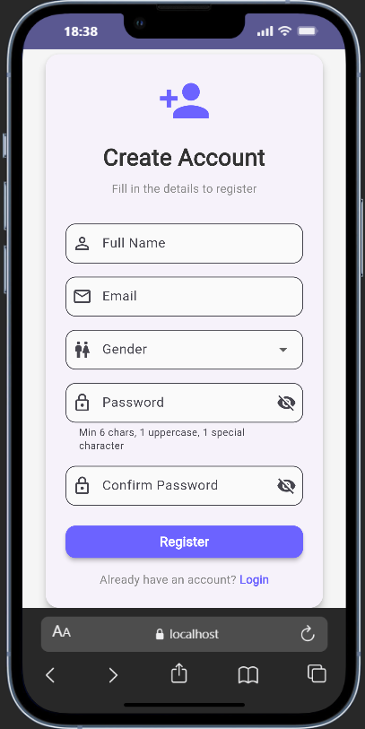
  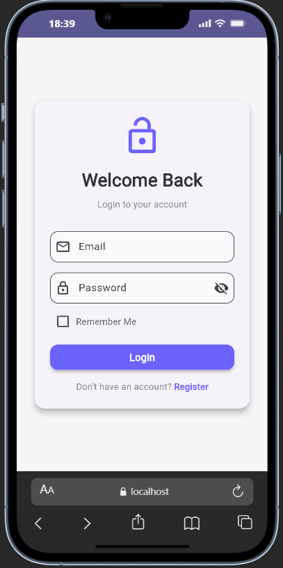
</p>

<p align="center">
  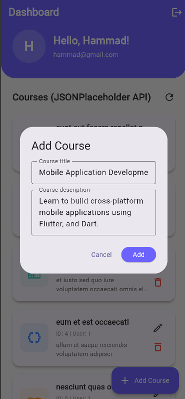
  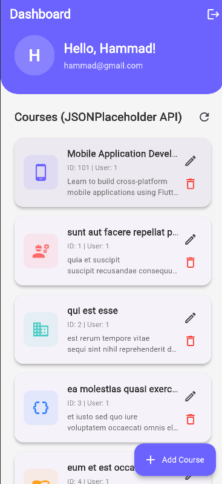
</p>

<p align="center">
  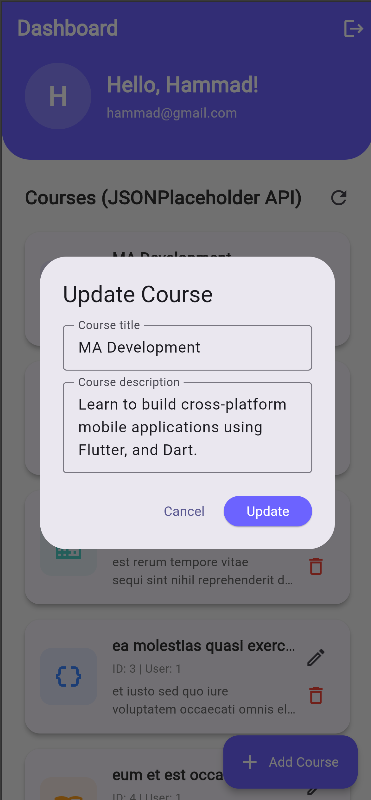
  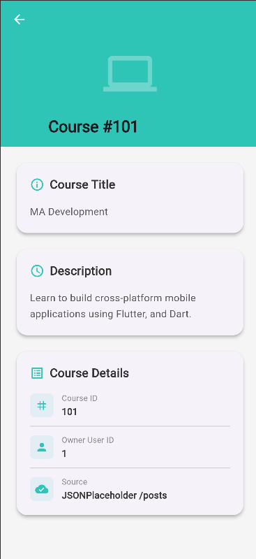
  
</p>

### Extension (Offline Support, State Management, Search)

<p align="center">
  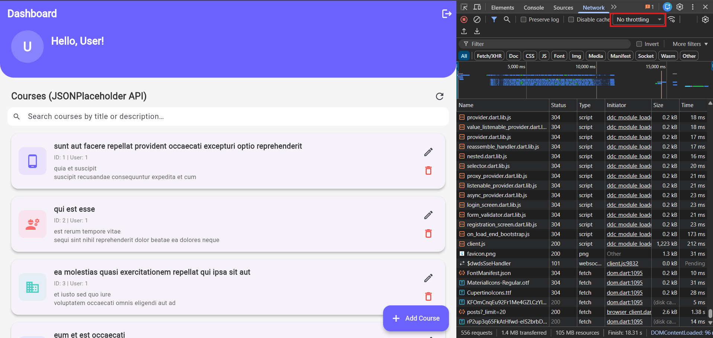
  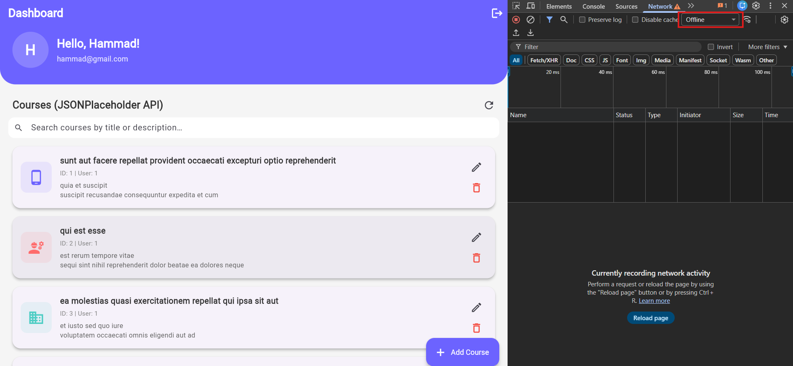
</p>

<p align="center">
  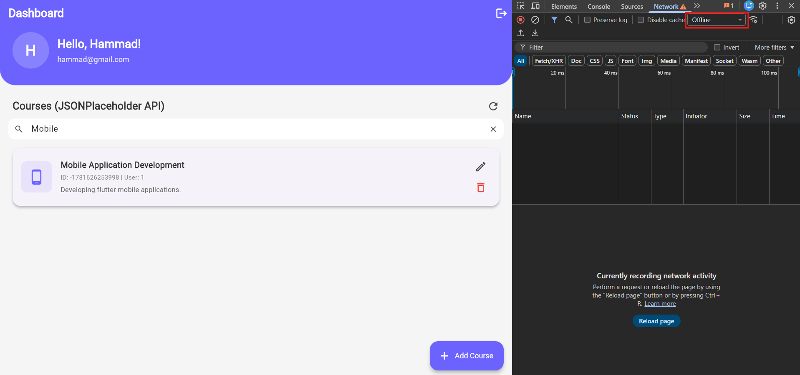
  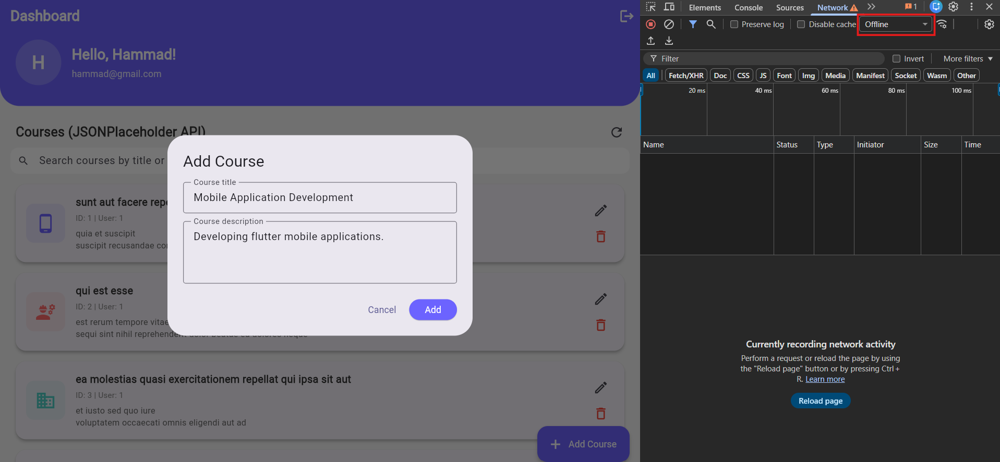
</p>

<p align="center">
  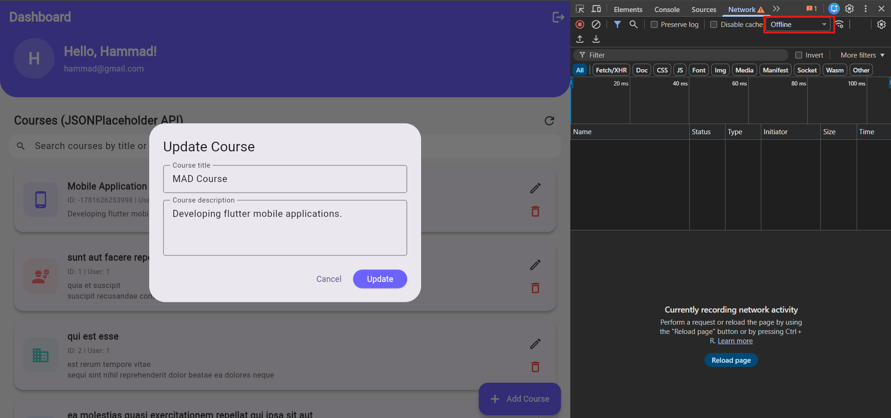
  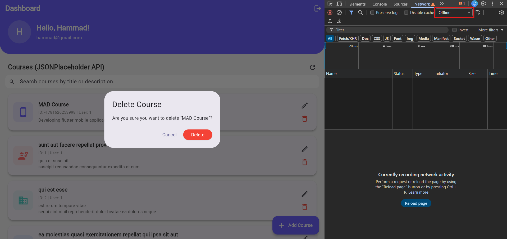
</p>

## Tech Stack

- Flutter SDK
- Dart
- Material 3 widgets
- `http` for REST API requests
- `provider` for state management (ChangeNotifier pattern)
- `hive` + `hive_flutter` for offline local storage
- `connectivity_plus` for network connectivity detection
- `flutter_lints` for static analysis

## Project Structure

The repository is organized by feature and responsibility:

```text
flutter_app/
├── android/                 # Android-specific native project files
├── app_ss/                  # App screenshots
├── ios/                     # iOS-specific native project files
├── linux/                   # Linux desktop runner files
├── macos/                   # macOS desktop runner files
├── web/                     # Web entry point and assets
├── windows/                 # Windows desktop runner files
├── lib/                     # Application source code
├── test/                    # Widget and unit tests
├── analysis_options.yaml    # Linting and analysis rules
├── pubspec.yaml             # Package metadata and dependencies
└── README.md                # Project documentation
```

### `lib/`

The application code is split into smaller folders following clean architecture:

```text
lib/
├── main.dart                # App bootstrap, Hive init, Provider setup, routes
├── controllers/             # In-memory auth logic
├── enums/                   # Enum definitions (AuthStatus, Gender, CourseStateStatus)
├── models/                  # Data models for users, subjects, and courses
├── providers/               # ChangeNotifier classes for state management
│   └── course_provider.dart # Manages courses, search, optimistic updates, rollback
├── repositories/            # Repository pattern (decides API vs local storage)
│   └── course_repository.dart
├── screens/                 # UI screens for each page
├── services/                # API service layer and local database service
│   ├── course_api_service.dart
│   └── local_database_service.dart
└── validators/              # Reusable form validation helpers
```

### Screen Responsibilities

- `RegistrationScreen` collects user details and creates a new in-memory account.
- `LoginScreen` authenticates a registered user and optionally remembers the email.
- `DashboardScreen` shows the current user and API-fetched courses with CRUD actions.
- `DetailScreen` displays selected course details from API data.

## Application Flow

### Registration

The registration screen validates the following fields:

- Full name must not be empty and must contain at least two characters.
- Email must follow a valid email format.
- Gender must be selected from the dropdown.
- Password must be at least six characters and include one uppercase letter and one special character.
- Confirm password must match the original password.

When registration succeeds, the user is redirected to the login screen.
If the email already exists in memory, the registration is rejected.

### Login

The login screen validates the email and password, then calls the in-memory auth controller.
If credentials are correct, the app navigates to the dashboard.
If the remember-me box is enabled, the app stores the email for the current session.

### Dashboard

After login, the dashboard shows:

- A welcome header with the user’s initials and email.
- A list of courses fetched from JSONPlaceholder API.
- Add, edit, and delete actions for each course item.
- Loading indicator, error handling, and retry support.
- A logout action that clears the current session and returns to login.

### Course Details

The dashboard routes to the detail screen and passes the selected course as a navigation argument.
The detail page renders:

- Course title
- Course description
- Course ID and owner user ID
- Data source reference

## Architecture

### Architecture Overview (Extension)

The app follows a layered **Repository Pattern** with clear separation of concerns:

```
UI (Screens)
    ↓  Consumer<CourseProvider>
CourseProvider (State Management — ChangeNotifier)
    ↓  delegates data operations
CourseRepository (Repository — decides data source)
    ↓               ↓
CourseApiService   LocalDatabaseService
  (HTTP only)        (Hive cache)
```

**Responsibilities:**

- **UI layer** — Screens consume state via `Consumer<CourseProvider>` and call provider methods.
- **CourseProvider** — Manages loading/success/error/empty states, search query, optimistic UI updates with snapshot-based rollback.
- **CourseRepository** — Checks connectivity, decides between API and local cache, handles try-catch fallback.
- **CourseApiService** — Pure HTTP operations only (GET, POST, PUT, DELETE).
- **LocalDatabaseService** — Hive box wrapper for caching courses as JSON.

### Offline-First Strategy

1. On fetch: if online → call API → cache result in Hive → return.
2. On fetch: if offline → return cached data from Hive.
3. If API fails despite connectivity check (e.g. Chrome DevTools throttling) → fall back to cache.
4. On add/update/delete: try API first → sync locally. On failure → apply changes locally only.

### Optimistic UI Updates

All CRUD operations update the UI immediately before the API call completes:

- **Add** — new course inserted at top with a temporary ID.
- **Update** — course data replaced in-place.
- **Delete** — course removed from the list.

If the API call fails, the previous state is restored automatically (rollback).

### Base Architecture (Original)

- `AuthController` is a singleton that stores registered users and session state.
- `CourseApiService` contains all API request logic (service layer).
- `UserModel`, `SubjectModel`, and `CourseModel` represent the app's data.
- `FormValidator` keeps validation logic separate from UI code.
- `Gender`, `AuthStatus`, and `CourseStateStatus` keep domain values explicit and readable.

State handling on dashboard includes explicit loading, error, success, and submitting states managed by `CourseProvider`.

Auth data is stored in memory (lost on restart). Course data is persisted locally via Hive cache.

## Routing

Routes are defined in `main.dart`:

- `/register` -> Registration screen
- `/login` -> Login screen
- `/dashboard` -> Dashboard screen
- `/detail` -> Course detail screen

The app starts on `/register`.

## Validation Rules

Validation helpers live in `lib/validators/form_validator.dart` and are reused across the forms.
This keeps the UI clean and ensures the same rules are applied consistently.

## Data Models

### `UserModel`

Stores:

- Full name
- Email
- Password
- Gender

### `SubjectModel`

Stores:

- Subject name
- Description
- Schedule
- Image key used as a logical identifier

The current subject list contains:

- Mobile App Development
- Software Re-engineering
- MIS

### `CourseModel`

Stores API-mapped fields:

- `id`
- `userId`
- `title`
- `description` (mapped from API `body`)

## Dependencies

| Package | Purpose |
|---------|----------|
| `flutter` | Flutter SDK |
| `cupertino_icons` | iOS-style icons |
| `http` | REST API requests |
| `provider` | State management via ChangeNotifier |
| `hive` | Lightweight NoSQL local database |
| `hive_flutter` | Flutter integration for Hive (init, path handling) |
| `connectivity_plus` | Network connectivity detection |
| `flutter_lints` | Static analysis rules |

## Getting Started

### Prerequisites

- Flutter SDK installed
- Dart SDK installed with Flutter
- A configured development device or emulator

### Install Dependencies

```bash
flutter pub get
```

### Run the App

```bash
flutter run
```

You can target Android, iOS, web, Windows, macOS, or Linux depending on your local setup.

### Run Tests

```bash
flutter test
```

## Screenshots

Store screenshots in `app_ss`.

## Branches

| Branch | Description |
|--------|-------------|
| `main` | Default / base app |
| `feature/course-api-integration` | Course CRUD with JSONPlaceholder API |
| `feature/offline-cache-and-state-manangement` | Offline support, Provider state management, repository pattern |

## Notes on the Current Codebase

- The app is currently a teaching/demo project, not a production auth system.
- User auth data is not persisted across app launches (in-memory only).
- Course data is cached locally via Hive and survives app restarts.
- The default test file still contains Flutter's template counter test and can be replaced with app-specific tests.
- Course CRUD uses JSONPlaceholder, which is designed for testing and does not permanently persist changes on the server.
- On Flutter Web, use a fixed dev server port (`--web-port=3000`) to ensure Hive cache persists across restarts.

## Documentation References

- Flutter docs: https://docs.flutter.dev/
- Flutter cookbook: https://docs.flutter.dev/cookbook
- Dart language docs: https://dart.dev/
- JSONPlaceholder guide: https://jsonplaceholder.typicode.com/guide
